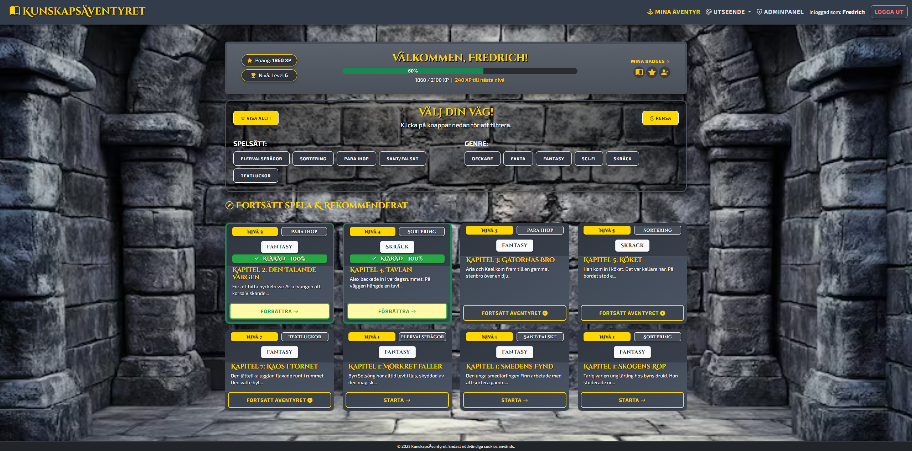
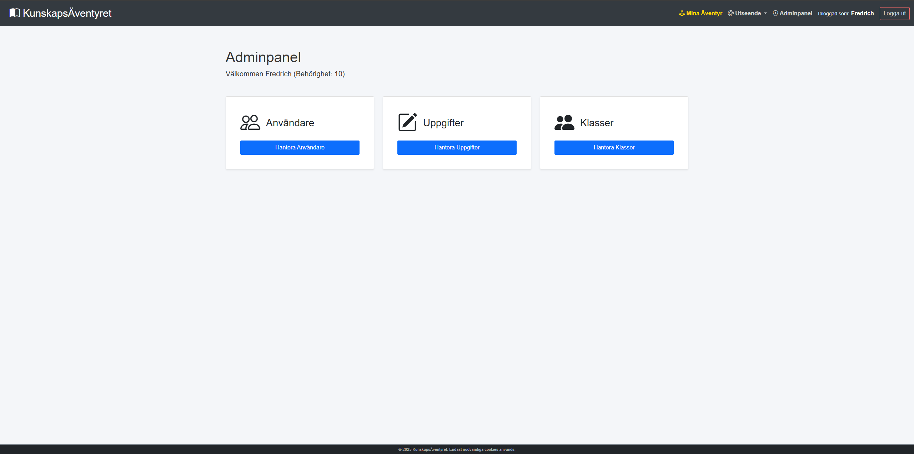

# 🏰 Kunskapsäventyret


**En gamifierad lärplattform där elever samlar XP, levlar upp och erövrar kunskap.**

Detta projekt är ett yrkesprov utvecklat för att demonstrera moderna webbutvecklingsprinciper, säkerhetstänk (RBAC, CSRF, XSS-skydd) och objektorienterad programmering (OOP). Systemet är byggt helt i "Vanilla" PHP utan ramverk som Laravel, för att visa djup förståelse för språket.

## 🚀 Nyckelfunktioner

### 🎮 Gamification & Progression

- **XP & Levels:** Dynamiskt system där XP beräknas och nivågränser hämtas från databasen (`level_config`).
- **Badges (Utmärkelser):** Automatisk utdelning av emblem baserat på prestation (t.ex. "Klara 10 Quiz").
- **Visuell Feedback:** Animerade progress-bars, teman och nivå-mätare.

### 📚 Interaktiva Uppgifter

Lärare kan skapa dynamiska uppgifter av flera typer:

- **Flervalsfrågor (Quiz)**
- **Sortering (Drag & Drop):** Använder SortableJS för interaktivitet.
- **Textluckor (Cloze Test):** Fyll i orden som saknas.
- **Para ihop:** Matcha begrepp med definition.
- **Sant eller Falskt**

### 🔒 Säkerhet & Arkitektur

- **RBAC (Role-Based Access Control):** Strikt uppdelning mellan **Elev** (Lvl 1) och **Lärare/Admin** (Lvl 5+).
- **Säkerhet:**
  - **XSS-skydd:** All utdata saneras via `cleanInput()` och `htmlspecialchars`.
  - **CSRF-skydd:** Alla formulär (inloggning, uppgifter, inställningar) skyddas med kryptografiska tokens.
  - **SQL Injection:** 100% användning av PDO Prepared Statements.
- **OOP/MVC-struktur:** Logik separerad i klasser (`User`, `Task`, `School`) med Dependency Injection.

## 📸 Screenshots

|                Dashboard (Elev)                 |           Adminpanel (Lärare)           |
| :---------------------------------------------: | :-------------------------------------: |
|  |  |

## ⚙️ Installation & Setup

### Förutsättningar

- Webserver (t.ex. Apache via XAMPP, MAMP eller Docker).
- PHP 8.0 eller högre.
- MySQL / MariaDB.

### Steg-för-steg

1.  **Kloning:**
    ```bash
    git clone https://github.com/EagleEyeZombie/utbildningsportal.git
    ```
2.  **Databas:**
    - Skapa en databas som heter `utbildningsportal`.
    - Importera filen `utbildningsportal_db.sql` (finns i roten) via phpMyAdmin eller terminalen.
3.  **Konfiguration:**
    - Kontrollera inställningarna i `include/config.php` så att de matchar din lokala miljö (host, user, password). Standard är ofta `root` och tomt lösenord.

## 🔑 Testinloggning

Använd dessa konton för att testa de olika rollerna i systemet:

| Roll               | Användarnamn      | Lösenord     | Notering                            |
| :----------------- | :---------------- | :----------- | :---------------------------------- |
| **Admin / Lärare** | `TestAdmin`       | `Testadmin!` | Har tillgång till Adminpanelen      |
| **Elev**           | `TestElev`        | `Testelev!`  | Kan göra uppgifter och se Dashboard |
| **Ny Elev**        | _(Registrera ny)_ | _(Valfritt)_ | Testa registreringsflödet           |

_(Obs: Lösenorden är hashade i databasen. Om du inte minns dem, skapa nya användare via `register.php` eller `admin_dashboard.php`)_

## 📂 Projektstruktur

- `assets/` - Dokumentation, bilder och ikoner.
- `css/` & `js/` - Frontend-resurser och logik.
- `include/` - Backend-kärna:
  - `config.php` - Databaskoppling och sessionsinställningar.
  - `functions.php` - Globala hjälpfunktioner (Security).
  - `class_*.php` - Modeller (User, Task, School).
- `*.php` - Vyer och Controllers (t.ex. `dashboard.php`, `admin_tasks.php`).

---

_Utvecklad av [Fredrich Kjellberg] - 2025_
